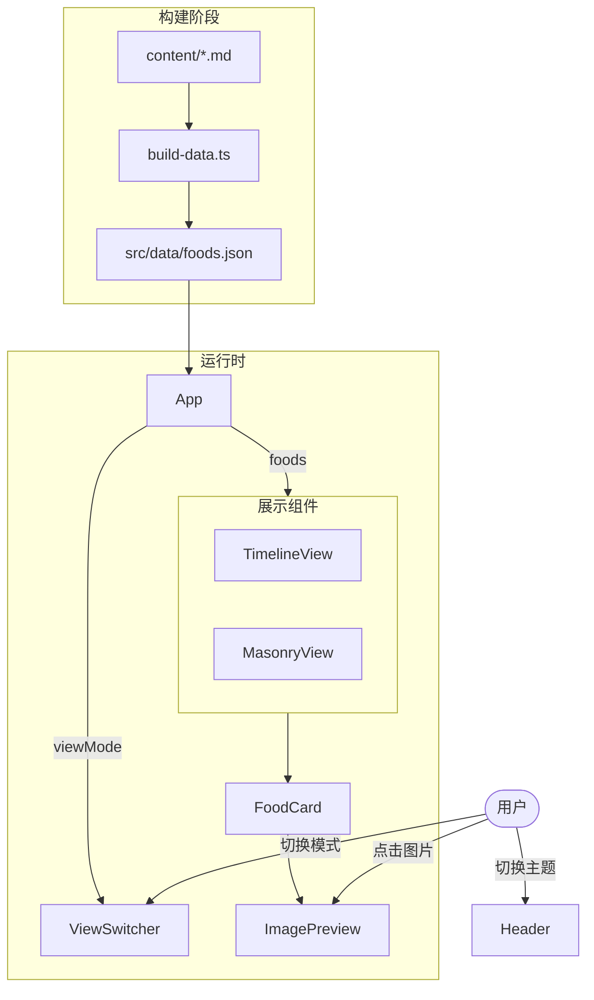

# 美食日记移动端网站 - 技术设计

## 1. 实现概述

基于 React + Vite 构建纯静态美食展示网站，部署到 GitHub Pages。

**核心技术选型**：
| 方面 | 选择 | 理由 |
|------|------|------|
| 框架 | React + Vite | 构建快，生态好 |
| 样式 | Tailwind CSS v4 | 原子化 CSS，开发效率高 |
| 状态管理 | useState | 简单场景足够 |
| 数据 | 构建时解析 Markdown | 零运行时开销 |
| 路由 | 无（单页应用） | 简单直接 |

**构建流程**：
```
content/*.md + images/ → Vite 构建时解析 → 静态 JSON → React 渲染 → GitHub Pages
```

## 2. 文件结构

```
/
├── content/
│   └── foods/                    # Markdown 美食记录
│       └── 2024-01-15-hongshao-rou.md
├── public/
│   └── images/                   # 美食图片
│       └── hongshao-rou.jpg
├── src/
│   ├── components/
│   │   ├── App.tsx               # 根组件，状态管理
│   │   ├── Header.tsx            # 顶部导航，主题切换
│   │   ├── ViewSwitcher.tsx      # 展示模式切换
│   │   ├── FoodCard.tsx          # 美食卡片（复用于各模式）
│   │   ├── ImagePreview.tsx      # 图片预览弹窗
│   │   ├── TimelineView.tsx      # 时间线展示
│   │   ├── MasonryView.tsx       # 瀑布流展示
│   │   └── EmptyState.tsx        # 空状态
│   ├── hooks/
│   │   └── useTheme.ts           # 深浅色主题 hook
│   ├── types/
│   │   └── food.ts               # 类型定义
│   ├── utils/
│   │   └── groupByDate.ts        # 日期分组工具
│   ├── data/
│   │   └── foods.json            # 构建时生成的数据文件
│   ├── main.tsx                  # 入口
│   └── index.css                 # Tailwind 入口
├── scripts/
│   └── build-data.ts             # 构建时解析 Markdown 脚本
├── .github/
│   └── workflows/
│       └── deploy.yml            # GitHub Actions 部署
├── tailwind.config.js
├── vite.config.ts
└── package.json
```

## 3. 数据流



## 4. 核心模块设计

### 4.1 数据解析模块

- **职责**: 构建时将 Markdown 文件解析为 JSON
- **文件**: `scripts/build-data.ts`
- **执行时机**: `vite build` 前执行

```typescript
interface FoodItem {
  id: string
  name: string
  description: string
  tags: string[]
  date: string
  image: string
}

interface FoodsData {
  items: FoodItem[]
  allTags: string[]
}
```

**实现要点**：
- 使用 `gray-matter` 解析 frontmatter
- 使用 `glob` 扫描 `content/foods/*.md`
- 输出到 `src/data/foods.json`
- 按日期倒序排列

### 4.2 App 根组件

- **职责**: 管理全局状态，组合各子组件
- **文件**: `src/components/App.tsx`

```typescript
type ViewMode = 'timeline' | 'masonry'

interface AppState {
  viewMode: ViewMode
}
```

**状态流转**：
- `viewMode` 改变 → 切换展示组件

### 4.3 主题切换 Hook

- **职责**: 管理深浅色模式，持久化到 localStorage
- **文件**: `src/hooks/useTheme.ts`

```typescript
type Theme = 'light' | 'dark' | 'system'

interface UseThemeReturn {
  theme: Theme
  resolvedTheme: 'light' | 'dark'
  setTheme: (theme: Theme) => void
}
```

**实现要点**：
- 监听 `prefers-color-scheme` 媒体查询
- 通过 `<html class="dark">` 控制 Tailwind 暗色模式
- localStorage 持久化用户选择

### 4.4 时间线展示组件

- **职责**: 按日期分组展示美食卡片
- **文件**: `src/components/TimelineView.tsx`

```typescript
interface TimelineViewProps {
  foods: FoodItem[]
}
```

**布局**：
- 移动端：单列卡片流，左侧时间轴线
- 桌面端：卡片交错左右排列

### 4.5 瀑布流展示组件

- **职责**: Pinterest 风格多列布局
- **文件**: `src/components/MasonryView.tsx`

**实现要点**：
- 使用 CSS columns 实现
- 移动端 2 列，桌面端 3-4 列
- 图片高度不一时保持视觉平衡

### 4.6 美食卡片组件

- **职责**: 展示单个美食记录，复用于各展示模式
- **文件**: `src/components/FoodCard.tsx`

```typescript
interface FoodCardProps {
  food: FoodItem
  variant?: 'default' | 'compact' | 'featured'
}
```

**内容**：
- 图片（懒加载 + 骨架屏 + 点击预览）
- 标签列表（菜名）
- 日期

### 4.7 图片预览组件

- **职责**: 居中预览图片，支持关闭
- **文件**: `src/components/ImagePreview.tsx`

```typescript
interface ImagePreviewProps {
  src: string
  alt: string
  onClose: () => void
}
```

**实现要点**：
- 全屏半透明黑色背景
- 图片使用 `max-w-full max-h-full object-contain` 自适应屏幕
- 点击背景或关闭按钮退出
- 按 ESC 键退出

## 5. 关键实现细节

### 5.1 构建时数据生成

Vite 构建前执行脚本解析 Markdown：

```typescript
// scripts/build-data.ts
async function buildData() {
  const files = glob.sync('content/foods/*.md')
  const items = files.map(file => {
    const content = fs.readFileSync(file, 'utf-8')
    const { data, content: body } = matter(content)
    return {
      id: path.basename(file, '.md'),
      name: data.name,
      description: body.trim(),
      tags: data.tags,
      date: data.date,
      image: data.image
    }
  })

  items.sort((a, b) => b.date.localeCompare(a.date))
  const allTags = [...new Set(items.flatMap(i => i.tags))]

  fs.writeFileSync('src/data/foods.json', JSON.stringify({ items, allTags }))
}
```

### 5.2 图片懒加载与骨架屏

```tsx
// FoodCard 中的图片处理
const [imageLoaded, setImageLoaded] = useState(false)

 setImageLoaded(true)}
/>

{!imageLoaded && (
  <div className="absolute animate-pulse bg-gray-300" />
)}
```

### 5.3 图片预览实现

```tsx
// ImagePreview 组件
 e.stopPropagation()}
/>
```

### 5.4 GitHub Actions 部署

```yaml
# .github/workflows/deploy.yml
name: Deploy to GitHub Pages

on:
  push:
    branches: [main]

jobs:
  deploy:
    runs-on: ubuntu-latest
    steps:
      - uses: actions/checkout@v4
      - uses: pnpm/action-setup@v4
      - uses: actions/setup-node@v4
      - run: pnpm install
      - run: pnpm run build
      - uses: actions/deploy-pages@v4
```

## 6. 依赖关系

### 需要安装的包

**生产依赖**：
- `react`, `react-dom`

**开发依赖**：
- `vite`, `@vitejs/plugin-react`
- `typescript`, `@types/react`, `@types/react-dom`
- `tailwindcss`, `@tailwindcss/postcss`, `postcss`, `autoprefixer`
- `gray-matter` (解析 Markdown frontmatter)
- `glob` (文件扫描)
- `tsx` (执行 TypeScript 脚本)
- `vitest` (测试框架)

## 7. 测试要点

- **数据解析**：Markdown 格式正确解析，异常格式有提示
- **展示模式切换**：两种模式切换平滑，数据保持一致
- **主题切换**：深浅色正确切换，刷新后保持
- **响应式**：移动端/桌面端布局正确
- **图片加载**：懒加载生效，失败显示占位图
- **图片预览**：点击图片打开预览，点击背景或 ESC 关闭
- **空状态**：无数据时显示引导

## 8. 实现顺序

### 阶段一：基础框架
1. 创建 Vite + React + TypeScript 项目
2. 配置 Tailwind CSS
3. 创建项目目录结构
4. 创建类型定义文件

### 阶段二：数据层
1. 编写 `build-data.ts` 脚本
2. 创建示例 Markdown 文件测试解析
3. 验证 JSON 输出正确

### 阶段三：基础组件
1. 实现 `FoodCard` 组件
2. 实现 `Header` 组件（含主题切换）
3. 实现 `useTheme` hook
4. 实现 `ImagePreview` 组件
5. 实现 `EmptyState` 组件

### 阶段四：展示组件
1. 实现 `TimelineView` 组件
2. 实现 `MasonryView` 组件
3. 实现 `ViewSwitcher` 组件

### 阶段五：整合与部署
1. 实现 `App` 组件，整合状态管理
2. 配置 GitHub Actions
3. 部署到 GitHub Pages
4. 验收测试
