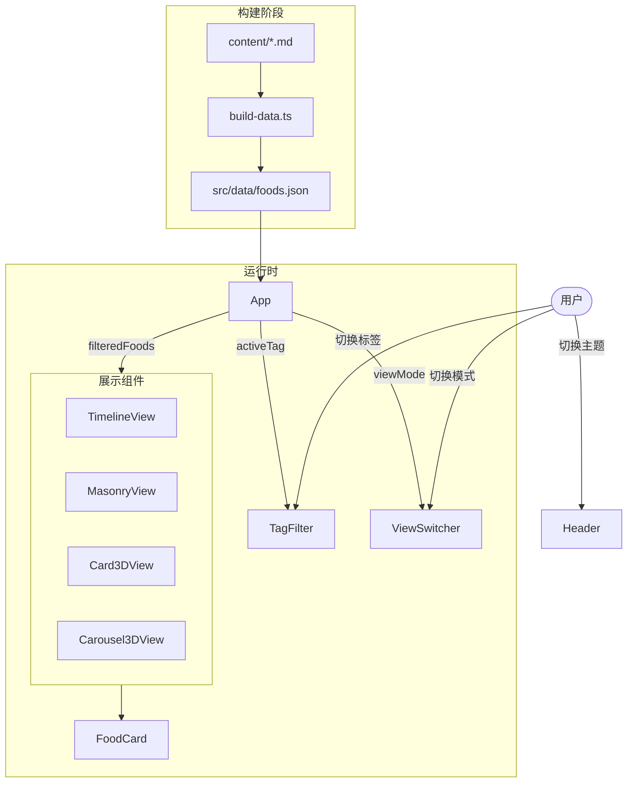

# 美食日记移动端网站 - 技术设计

## 1. 实现概述

基于 React + Vite 构建纯静态美食展示网站，部署到 GitHub Pages。

**核心技术选型**：
| 方面 | 选择 | 理由 |
|------|------|------|
| 框架 | React + Vite | 构建快，生态好 |
| 样式 | Tailwind CSS | 原子化 CSS，开发效率高 |
| 3D 效果 | CSS 3D transforms | 无额外依赖，性能好 |
| 状态管理 | useState | 简单场景足够 |
| 数据 | 构建时解析 Markdown | 零运行时开销 |
| 路由 | 无（单页应用） | 简单直接 |

**构建流程**：
```
content/*.md + images/ → Vite 构建时解析 → 静态 JSON → React 渲染 → GitHub Pages
```

## 2. 文件结构

```
/
├── content/
│   └── foods/                    # Markdown 美食记录
│       └── 2024-01-15-hongshao-rou.md
├── public/
│   └── images/                   # 美食图片
│       └── hongshao-rou.jpg
├── src/
│   ├── components/
│   │   ├── App.tsx               # 根组件，状态管理
│   │   ├── Header.tsx            # 顶部导航，主题切换
│   │   ├── TagFilter.tsx         # 标签筛选栏
│   │   ├── ViewSwitcher.tsx      # 展示模式切换
│   │   ├── FoodCard.tsx          # 美食卡片（复用于各模式）
│   │   ├── TimelineView.tsx      # 时间线展示
│   │   ├── MasonryView.tsx       # 瀑布流展示
│   │   ├── Card3DView.tsx        # 3D 卡片浮动
│   │   ├── Carousel3DView.tsx    # 3D 圆柱/球体展示
│   │   └── EmptyState.tsx        # 空状态
│   ├── hooks/
│   │   └── useTheme.ts           # 深浅色主题 hook
│   ├── types/
│   │   └── food.ts               # 类型定义
│   ├── data/
│   │   └── foods.json            # 构建时生成的数据文件
│   ├── main.tsx                  # 入口
│   └── index.css                 # Tailwind 入口
├── scripts/
│   └── build-data.ts             # 构建时解析 Markdown 脚本
├── .github/
│   └── workflows/
│       └── deploy.yml            # GitHub Actions 部署
├── tailwind.config.js
├── vite.config.ts
└── package.json
```

## 3. 数据流



## 4. 核心模块设计

### 4.1 数据解析模块

- **职责**: 构建时将 Markdown 文件解析为 JSON
- **文件**: `scripts/build-data.ts`
- **执行时机**: `vite build` 前执行

```typescript
interface FoodItem {
  id: string
  name: string
  description: string
  tags: string[]
  date: string
  image: string
}

interface FoodsData {
  items: FoodItem[]
  allTags: string[]
}
```

**实现要点**：
- 使用 `gray-matter` 解析 frontmatter
- 使用 `glob` 扫描 `content/foods/*.md`
- 输出到 `src/data/foods.json`
- 按日期倒序排列

### 4.2 App 根组件

- **职责**: 管理全局状态，组合各子组件
- **文件**: `src/components/App.tsx`

```typescript
type ViewMode = 'timeline' | 'masonry' | 'card3d' | 'carousel3d'

interface AppState {
  activeTag: string | null
  viewMode: ViewMode
}
```

**状态流转**：
- `activeTag` 改变 → 过滤 `foods` → 传给当前 View
- `viewMode` 改变 → 切换展示组件

### 4.3 主题切换 Hook

- **职责**: 管理深浅色模式，持久化到 localStorage
- **文件**: `src/hooks/useTheme.ts`

```typescript
type Theme = 'light' | 'dark' | 'system'

interface UseThemeReturn {
  theme: Theme
  resolvedTheme: 'light' | 'dark'
  setTheme: (theme: Theme) => void
}
```

**实现要点**：
- 监听 `prefers-color-scheme` 媒体查询
- 通过 `<html class="dark">` 控制 Tailwind 暗色模式
- localStorage 持久化用户选择

### 4.4 时间线展示组件

- **职责**: 按日期分组展示美食卡片
- **文件**: `src/components/TimelineView.tsx`

```typescript
interface TimelineViewProps {
  foods: FoodItem[]
}
```

**布局**：
- 移动端：单列卡片流，左侧时间轴线
- 桌面端：卡片交错左右排列

### 4.5 瀑布流展示组件

- **职责**: Pinterest 风格多列布局
- **文件**: `src/components/MasonryView.tsx`

**实现要点**：
- 使用 CSS columns 或 grid 实现
- 移动端 2 列，桌面端 3-4 列
- 图片高度不一时保持视觉平衡

### 4.6 3D 卡片浮动组件

- **职责**: 卡片在 3D 空间中悬浮、随鼠标/触摸旋转
- **文件**: `src/components/Card3DView.tsx`

**实现要点**：
- CSS `transform-style: preserve-3d`
- `perspective` 设置视角距离
- 鼠标移动 → 计算角度 → 更新 `rotateX/rotateY`
- 触摸设备：陀螺仪或触摸位置

```css
.card-3d {
  transform-style: preserve-3d;
  transition: transform 0.1s ease-out;
}

.card-3d:hover {
  transform: rotateY(var(--rotateY)) rotateX(var(--rotateX));
}
```

### 4.7 3D 圆柱/球体展示组件

- **职责**: 卡片环绕成圆柱或球体，可旋转浏览
- **文件**: `src/components/Carousel3DView.tsx`

**实现要点**：
- 计算每张卡片的 `rotateY` 角度（360° / 卡片数）
- `translateZ` 设置半径
- 整体容器旋转实现切换
- 触摸滑动或自动轮播

```css
.carousel-container {
  transform-style: preserve-3d;
  transform: rotateY(var(--angle));
}

.carousel-item {
  position: absolute;
  transform: rotateY(calc(var(--index) * 45deg)) translateZ(300px);
}
```

### 4.8 美食卡片组件

- **职责**: 展示单个美食记录，复用于各展示模式
- **文件**: `src/components/FoodCard.tsx`

```typescript
interface FoodCardProps {
  food: FoodItem
  variant?: 'default' | 'compact' | 'featured'
}
```

**内容**：
- 图片（懒加载）
- 名称
- 描述（可截断）
- 标签列表
- 日期

## 5. 关键实现细节

### 5.1 构建时数据生成

Vite 构建前执行脚本解析 Markdown：

```typescript
// scripts/build-data.ts 伪代码
async function buildData() {
  const files = glob.sync('content/foods/*.md')
  const items = files.map(file => {
    const content = fs.readFileSync(file, 'utf-8')
    const { data, content: body } = matter(content)
    return {
      id: path.basename(file, '.md'),
      name: data.name,
      description: body.trim(),
      tags: data.tags,
      date: data.date,
      image: data.image
    }
  })

  // 按日期倒序
  items.sort((a, b) => b.date.localeCompare(a.date))

  // 提取所有标签
  const allTags = [...new Set(items.flatMap(i => i.tags))]

  fs.writeFileSync('src/data/foods.json', JSON.stringify({ items, allTags }))
}
```

package.json 配置：
```json
{
  "scripts": {
    "prebuild": "tsx scripts/build-data.ts",
    "build": "vite build"
  }
}
```

### 5.2 图片懒加载

使用原生 `loading="lazy"` + Intersection Observer 双重保障：

```tsx
// FoodCard 中的图片处理
 {
    e.currentTarget.src = '/images/placeholder.jpg'
  }}
/>
```

### 5.3 CSS 3D 卡片交互

```typescript
// Card3DView 中的鼠标跟踪
function handleMouseMove(e: MouseEvent, cardRef: HTMLDivElement) {
  const rect = cardRef.getBoundingClientRect()
  const x = e.clientX - rect.left
  const y = e.clientY - rect.top
  const centerX = rect.width / 2
  const centerY = rect.height / 2

  const rotateY = ((x - centerX) / centerX) * 15 // 最大 15 度
  const rotateX = ((centerY - y) / centerY) * 15

  cardRef.style.setProperty('--rotateX', `${rotateX}deg`)
  cardRef.style.setProperty('--rotateY', `${rotateY}deg`)
}
```

### 5.4 3D 性能优化

```typescript
// 检测设备性能，低端设备降级
function shouldEnable3D(): boolean {
  // 检查是否支持 3D transforms
  const supports3D = CSS.supports('transform-style', 'preserve-3d')

  // 检查是否低端设备（简单判断）
  const isLowEnd = navigator.hardwareConcurrency <= 2

  // 用户偏好减少动画
  const prefersReducedMotion = window.matchMedia(
    '(prefers-reduced-motion: reduce)'
  ).matches

  return supports3D && !isLowEnd && !prefersReducedMotion
}
```

### 5.5 GitHub Actions 部署

```yaml
# .github/workflows/deploy.yml
name: Deploy to GitHub Pages

on:
  push:
    branches: [main]

jobs:
  deploy:
    runs-on: ubuntu-latest
    steps:
      - uses: actions/checkout@v4

      - uses: actions/setup-node@v4
        with:
          node-version: '20'
          cache: 'npm'

      - run: npm ci
      - run: npm run build

      - uses: peaceiris/actions-gh-pages@v3
        with:
          github_token: ${{ secrets.GITHUB_TOKEN }}
          publish_dir: ./dist
```

## 6. 依赖关系

### 需要安装的包

**生产依赖**：
- `react`, `react-dom`

**开发依赖**：
- `vite`, `@vitejs/plugin-react`
- `typescript`, `@types/react`, `@types/react-dom`
- `tailwindcss`, `postcss`, `autoprefixer`
- `gray-matter` (解析 Markdown frontmatter)
- `glob` (文件扫描)
- `tsx` (执行 TypeScript 脚本)

### 需要创建的新文件

全部为新建文件（新项目）。

## 7. 测试要点

- **数据解析**：Markdown 格式正确解析，异常格式有提示
- **标签筛选**：点击标签正确过滤，再次点击取消
- **展示模式切换**：四种模式切换平滑，数据保持一致
- **主题切换**：深浅色正确切换，刷新后保持
- **响应式**：移动端/桌面端布局正确
- **3D 效果**：支持的设备正常显示，不支持的优雅降级
- **图片加载**：懒加载生效，失败显示占位图
- **空状态**：无数据或筛选无结果时显示引导

## 8. 实现顺序

### 阶段一：MVP

#### 子功能 1.1: 项目初始化
1. 创建 Vite + React + TypeScript 项目
2. 配置 Tailwind CSS
3. 配置项目目录结构
4. 创建类型定义文件

#### 子功能 1.2: 数据层
1. 编写 `build-data.ts` 脚本
2. 创建示例 Markdown 文件测试解析
3. 验证 JSON 输出正确

#### 子功能 1.3: 基础组件
1. 实现 `FoodCard` 组件
2. 实现 `Header` 组件（含主题切换）
3. 实现 `useTheme` hook
4. 实现 `TagFilter` 组件
5. 实现 `EmptyState` 组件

#### 子功能 1.4: 时间线展示
1. 实现 `TimelineView` 组件
2. 按日期分组逻辑
3. 响应式布局适配

#### 子功能 1.5: 整合与部署
1. 实现 `App` 组件，整合状态管理
2. 配置 GitHub Actions
3. 部署到 GitHub Pages
4. 验收测试

### 阶段二：瀑布流 + 3D 卡片

#### 子功能 2.1: 瀑布流布局
1. 实现 `MasonryView` 组件
2. 响应式列数适配

#### 子功能 2.2: 3D 卡片浮动
1. 实现 `Card3DView` 组件
2. 鼠标/触摸交互
3. 性能检测与降级

#### 子功能 2.3: 展示模式切换
1. 实现 `ViewSwitcher` 组件
2. 整合到 App 中

### 阶段三：3D 轮播 + 优化

#### 子功能 3.1: 3D 圆柱/球体展示
1. 实现 `Carousel3DView` 组件
2. 触摸滑动交互
3. 自动轮播（可选）

#### 子功能 3.2: 性能优化
1. 图片懒加载优化
2. 3D 效果按需加载
3. 移动端性能调优

## 9. 待澄清

- 暂无
